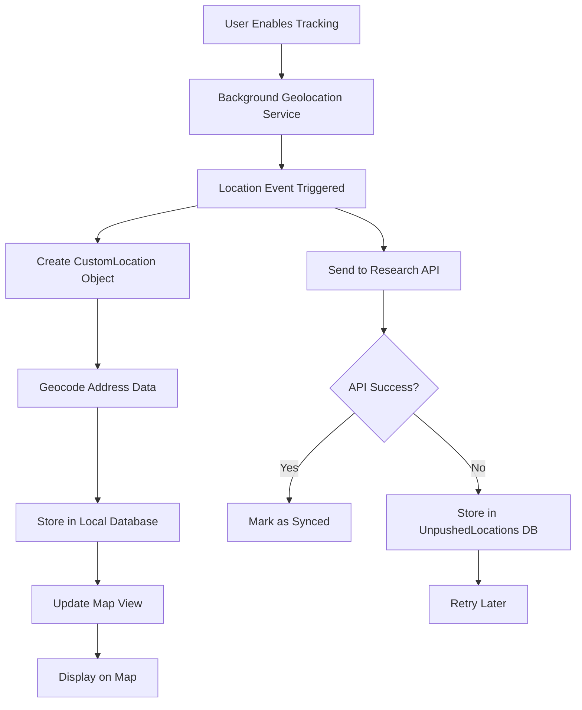
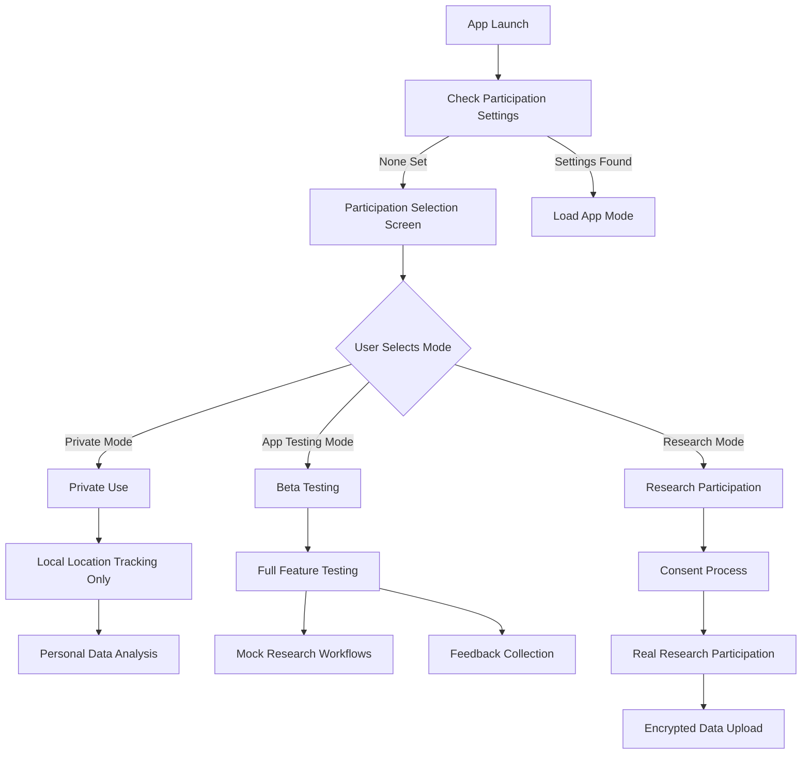
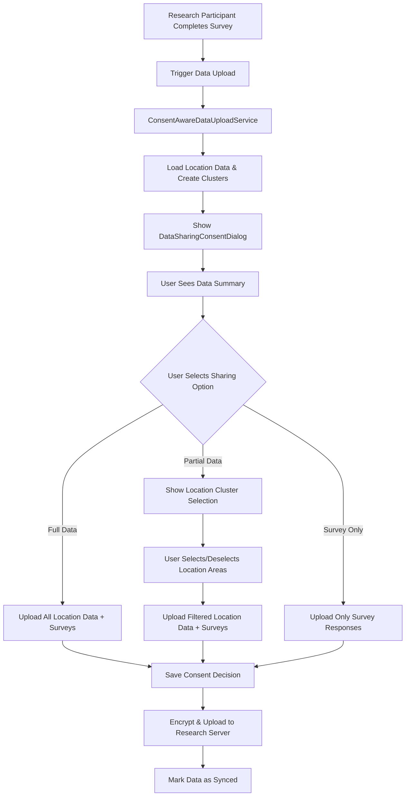
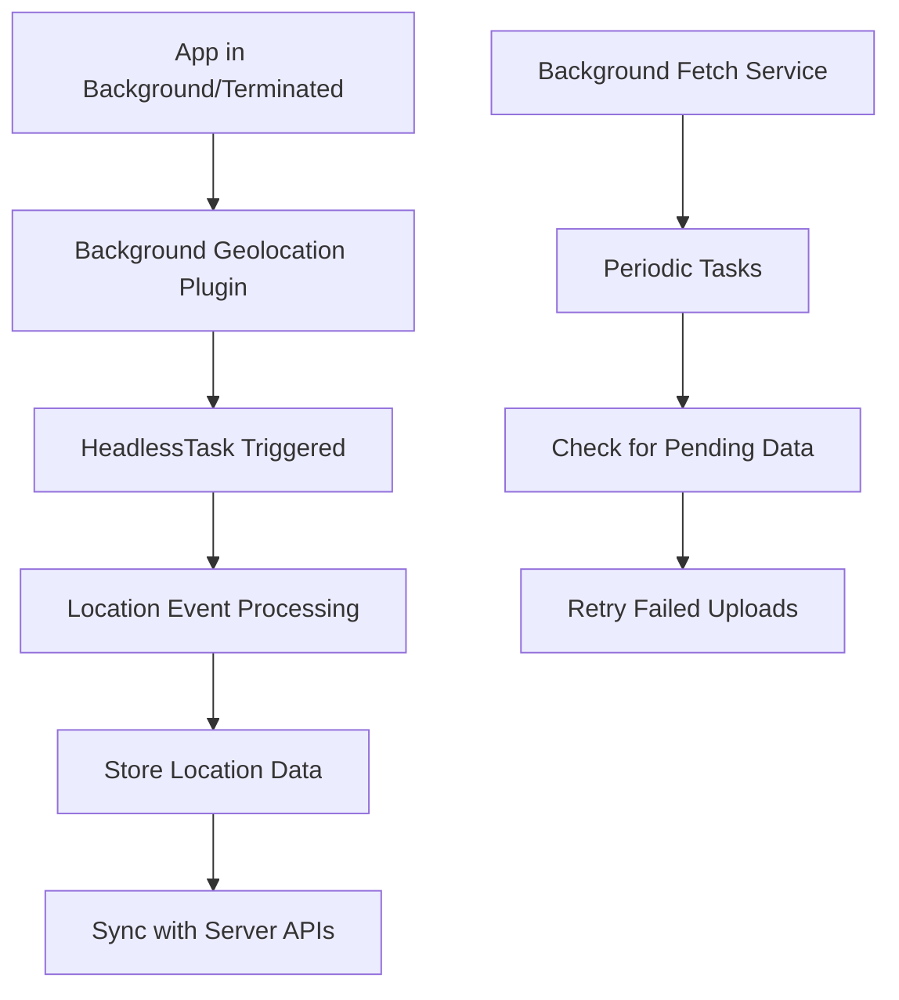

# Gauteng Wellbeing Mapper - Developer Guide

## Overview

Gauteng Wellbeing Mapper is a privacy-focused Flutter mobile application that enables users to map their mental wellbeing in environmental & climate context. As part of the Planet4Health project case study, the app facilitates research into how environmental and climate factors impact psychological health by allowing users to correlate location data with mental wellbeing indicators.

This version is specifically configured for the **Gauteng research study** with end-to-end encryption for secure data transmission to research servers in Gauteng, South Africa.

### App Configuration
- **Bundle ID**: `com.github.activityspacelab.wellbeingmapper.gauteng`
- **Package Name** (Android): `com.github.activityspacelab.wellbeingmapper.gauteng`
- **App Store ID** (iOS): [To be configured upon App Store submission]

### Planet4Health Integration

This application supports the Planet4Health research initiative "[Mental wellbeing in environmental & climate context](https://planet4health.eu/mental-wellbeing-in-environmental-climate-context/)", which addresses the growing recognition that environmental and climate changes contribute to mental health challenges including climate-related psychological distress.

## Table of Contents

1. [Architecture Overview](#architecture-overview)
2. [API Reference](#api-reference)
3. [Notification System](#notification-system)
4. [Research Participation System](#research-participation-system)
5. [Encryption & Security](#encryption--security)
6. [Flutter Background Geolocation - Critical Implementation Notes](#flutter-background-geolocation---critical-implementation-notes)
7. [Core Components](#core-components)
6. [Data Flow](#data-flow)
7. [File Structure](#file-structure)
8. [Getting Started](#getting-started)
9. [Development Workflow](#development-workflow)
10. [Server Setup](#server-setup)
11. [Testing](#testing)
12. [Screenshots & Visual Documentation](#screenshots--visual-documentation)
12. [Deployment](#deployment)

## Architecture Overview

Wellbeing Mapper follows a modular Flutter architecture with clear separation of concerns:

```
┌─────────────────────────────────────────┐
│                 UI Layer                │
│  (Views, Widgets, User Interface)       │
├─────────────────────────────────────────┤
│              Business Logic             │
│   (Encryption, State, Controllers)      │
├─────────────────────────────────────────┤
│               Data Layer                │
│ (Models, Databases, Encrypted Uploads)  │
├─────────────────────────────────────────┤
│             Platform Layer              │
│  (Background Services, Native Plugins)  │
└─────────────────────────────────────────┘
```

### Key Technologies Used

- **Flutter Framework**: Cross-platform mobile development (3.27.1 required)
- **SQLite**: Local data storage with location tracking
- **RSA + AES Encryption**: Hybrid encryption for secure data transmission
- **Background Geolocation**: Location tracking when app is closed
- **WebView**: For surveys and external content
- **SharedPreferences**: User settings and simple data storage
- **HTTP**: Encrypted data uploads to research servers

## API Reference

For complete API documentation including all classes, methods, and interfaces, see:
- **[API Reference](API_REFERENCE.md)** - Complete API documentation
- **Core Services**: Data upload, encryption, location tracking
- **Models**: Survey data, consent models, location models
- **UI Components**: Custom widgets and screens

### Key API Classes

- `DataUploadService` - Handles encrypted data transmission
- `LocationTrackingService` - Background location collection
- `SurveyService` - Survey data management
- `EncryptionService` - RSA+AES encryption implementation
- `AppModeService` - App mode and configuration management

## Notification System

The app includes a comprehensive notification system for survey reminders and research coordination:

- **[Notification Feature Summary](NOTIFICATION_FEATURE_SUMMARY.md)** - Complete notification system documentation
- **Biweekly Survey Reminders** - Automated survey scheduling
- **Configurable Timing** - Customizable reminder schedules for testing
- **Google Play Compliance** - Uses inexact alarms for battery efficiency
- **Cross-Platform Support** - Works on both iOS and Android

### Notification Features

- **Smart Scheduling** - Respects user preferences and device settings
- **Battery Optimization** - Uses efficient alarm scheduling
- **User Control** - Full notification management in settings
- **Testing Capabilities** - Fast scheduling for beta testing

## App Mode System

### Current Beta Configuration

The app uses a flexible mode system that allows switching between different operational modes. During beta testing, the following modes are available:

```dart
enum AppMode {
  private,      // Personal use only
  appTesting,   // Beta testing of research features
  // research,  // Real research participation (disabled in beta)
}
```

### Mode Configuration

**File**: `lib/models/app_mode.dart`

The beta/release status is controlled by a single boolean:

```dart
static const bool _isBetaPhase = true; // Set to false for research release
```

This automatically controls:
- Available modes in UI
- Feature availability
- Data collection behavior
- Upload functionality

### Mode Behaviors

| Feature | Private Mode | App Testing Mode | Research Mode (Future) |
|---------|-------------|------------------|----------------------|
| Location Tracking | ✅ Local only | ✅ Local only | ✅ Encrypted upload |
| Surveys | ✅ Local only | ✅ Local testing | ✅ Encrypted upload |
| Notifications | ✅ Personal | ✅ Testing intervals | ✅ Research schedule |
| Data Upload | ❌ Disabled | ❌ Disabled | ✅ Encrypted |
| Participant Code | ❌ Not needed | ❌ Auto-generated | ✅ Required |
| Consent Flow | ❌ Skipped | ❌ Skipped | ✅ Required |

### App Mode Service

**File**: `lib/services/app_mode_service.dart`

Provides centralized mode management:

```dart
// Get current mode
final mode = await AppModeService.getCurrentMode();

// Change mode
await AppModeService.setCurrentMode(AppMode.appTesting);

// Check capabilities
final hasResearchFeatures = await AppModeService.hasResearchFeatures();
final sendsData = await AppModeService.sendsDataToResearch();
```

### Mode Switching UI

Users can switch modes through:
1. **Initial Welcome Screen**: First-time mode selection
2. **Settings → Change Mode**: Switch between available modes
3. **App Mode Service**: Programmatic mode changes

### Beta Testing Benefits

App Testing Mode allows users to:
- Experience complete research workflows
- Practice with surveys and location tracking
- Test notification systems with faster intervals
- Understand data collection without privacy concerns
- Provide feedback on user experience

### Preparing for Research Release

To enable research mode:

1. **Update configuration**:
   ```dart
   static const bool _isBetaPhase = false;
   ```

2. **This automatically enables**:
   - Research mode in place of App Testing mode
   - Participant code requirements
   - Consent form workflows
   - Encrypted data uploads
   - Real research server connections

See [Beta Testing Guide](BETA_TESTING_GUIDE.md) for complete release preparation instructions.

## Encryption & Security

### Hybrid Encryption System

The app uses a two-layer encryption approach for maximum security:

1. **AES-256-GCM**: Encrypts the actual data (fast, efficient)
2. **RSA-4096-OAEP**: Encrypts the AES key (secure key exchange)

### Data Flow

```
Participant Data → JSON → AES Encrypt → RSA Encrypt Key → Base64 → HTTPS → Server
      ↓                      ↓              ↓               ↓        ↓
Survey Responses      Random AES Key   Research Team    Network   Secure Storage
Location Tracks       Per Upload       Public Key       Transit   Private Key Decrypt
```

### Security Features

- **Site Isolation**: Separate RSA key pairs for each research site
- **Forward Secrecy**: Each upload uses a unique AES key
- **Authenticated Encryption**: GCM mode prevents data tampering
- **Anonymous Identifiers**: Only UUID participant IDs, no personal data
- **Local-First**: Data encrypted before leaving device

### Key Management

Public keys are embedded in the app at build time:

```dart
// In lib/services/data_upload_service.dart
static const Map<String, ServerConfig> _serverConfigs = {
  'gauteng': ServerConfig(
    baseUrl: 'https://gauteng-server.com', 
    publicKey: '''-----BEGIN PUBLIC KEY-----
    [RSA-4096 PUBLIC KEY FOR GAUTENG]
    -----END PUBLIC KEY-----''',
  ),
};
```

## Flutter Background Geolocation - Critical Implementation Notes

### ⚠️ IMPORTANT WARNINGS

**DO NOT** execute any API method which will require accessing location-services until the `.ready(config)` method has been called. This is a critical requirement for proper initialization of the background geolocation plugin.

### License Key Configuration

The Flutter Background Geolocation plugin requires a license key that is tied to your app's bundle ID. For this app:

- **License Key Location**: `android/app/src/main/AndroidManifest.xml`
- **Bundle ID**: `com.github.activityspacelab.wellbeingmapper.gauteng`
- **Security Note**: The license key is committed to the repository because it only works with our specific bundle ID and cannot be used by other applications

```xml
<meta-data android:name="com.transistorsoft.locationmanager.license" 
           android:value="[LICENSE_KEY_HERE]" />
```

**Why it's safe to commit**: The license key is cryptographically tied to the bundle ID `com.github.activityspacelab.wellbeingmapper.gauteng` and will not function with any other app package name, making it safe to include in version control.

### Required Import Pattern
Always import the plugin with the `bg` namespace to avoid class name conflicts:

```dart
import 'package:flutter_background_geolocation/flutter_background_geolocation.dart' as bg;
```

**Why this matters**: The plugin uses common class names such as `Location`, `Config`, `State` that will conflict with other packages and Flutter's built-in classes. You must access every flutter_background_geolocation class with the `bg` prefix (i.e., `bg.Location`, `bg.Config`, `bg.State`).

### Proper Initialization Sequence

```dart
// ✅ CORRECT - Wait for ready() before any other API calls
await bg.BackgroundGeolocation.ready(bg.Config(
  // your configuration
)).then((bg.State state) {
  // Now safe to call other API methods
  if (!state.enabled) {
    bg.BackgroundGeolocation.start();
  }
});

// ❌ WRONG - Don't call API methods before ready()
bg.BackgroundGeolocation.start(); // This will fail!
```

### Common Pitfalls to Avoid

1. **Calling API methods before ready()**: Always wait for `.ready()` to complete
2. **Missing namespace**: Import without `as bg` causes class name conflicts
3. **State access without prefix**: Use `bg.State`, not `State`
4. **Location object confusion**: Use `bg.Location`, not Flutter's `Location`

For more details, see the [official plugin documentation](https://pub.dev/packages/flutter_background_geolocation#-using-the-plugin).

## Core Components

### 1. Main Application (`main.dart`)
- **Purpose**: Application entry point and global configuration
- **Key Functions**:
  - `main()`: Initializes the app and global data
  - `backgroundGeolocationHeadlessTask()`: Handles location events when app is terminated
  - `backgroundFetchHeadlessTask()`: Handles background fetch operations
- **Global Data**: Manages user UUID and app mode status

### 2. Home View (`ui/home_view.dart`)
- **Purpose**: Main application screen with map view
- **Key Functions**:
  - Location tracking control (start/stop)
  - Background geolocation configuration
  - App mode status management
  - Navigation to other screens
- **State Management**: Manages enabled state, location permissions

### 3. Map View (`ui/map_view.dart`)
- **Purpose**: Interactive map displaying user's location history
- **Key Functions**:
  - `_onLocation()`: Adds new location points to map
  - `_onMotionChange()`: Handles movement state changes
  - `_updateCurrentPositionMarker()`: Updates user's current position
- **Visual Elements**: Polylines for tracks, circles for locations, markers for stops

### 4. Database Management
Multiple SQLite databases handle different data types:

#### Unpushed Locations Database (`db/database_unpushed_locations.dart`)
- Stores locations that failed to sync to server
- Retry mechanism for failed uploads
- Data structure: `LocationToPush` model

### 5. Location Management (`models/custom_locations.dart`)
- **Purpose**: Manages location data and geocoding
- **Key Classes**:
  - `CustomLocation`: Represents a single location with metadata
  - `CustomLocationsManager`: Manages collections of locations
  - `ShareLocation`: Simplified location data for sharing
- **Key Functions**:
  - `createCustomLocation()`: Creates location from background geolocation data
  - `getLocationData()`: Reverse geocoding for addresses
  - `deleteThisLocation()`: Removes location from storage

### 6. Data Sharing Consent System (`models/data_sharing_consent.dart`, `ui/data_sharing_consent_dialog.dart`)
- **Purpose**: Advanced user consent management for research data sharing
- **Key Classes**:
  - `DataSharingConsent`: Consent preferences with granular location control
  - `LocationSharingOption`: Enum for sharing options (full, partial, survey-only)
  - `DataUploadSummary`: Preview information for users before consent
  - `LocationCluster`: Geographic clustering for privacy-friendly location selection
- **Key Functions**:
  - Interactive consent dialog with real-time data preview
  - Location clustering algorithm for area-based selection
  - Persistent consent tracking with history
  - Consent-aware data filtering during uploads

### 7. Consent-Aware Upload Service (`services/consent_aware_upload_service.dart`)
- **Purpose**: Data upload service that respects user consent preferences
- **Key Functions**:
  - `uploadWithConsent()`: Shows consent dialog and uploads according to preferences
  - `_getPartialLocationData()`: Filters location data based on selected clusters
  - Location clustering and distance calculation for geographic filtering
- **Integration**: Works with existing `DataUploadService` while adding consent layer

### 8. Data Sharing Preferences Management (`ui/data_sharing_preferences_screen.dart`)
- **Purpose**: Ongoing management interface for user consent preferences
- **Key Functions**:
  - View current consent settings and history
  - Update preferences without penalty
  - Privacy information and transparency features
- **Navigation**: Accessible through side drawer menu in research mode

### 9. Web Integration (`ui/web_view.dart`)
- **Purpose**: Displays surveys and external content for research participation
- **Key Functions**:
  - Load survey URLs with location data
  - Handle form auto-filling with location history
  - Manage survey completion flow

## Data Flow

### Location Tracking Flow


### App Mode Usage Flow


### Data Sharing Consent Flow


### Background Processing Flow


## File Structure


```
gauteng-wellbeing-mapper-app/lib/
├── main.dart                    # App entry point
├── main_debug.dart              # Debug configuration
├── main_original.dart           # Original entry point
├── main_simple.dart             # Simplified entry point  
├── shared_events.dart           # Event management system
├── styles.dart                  # Global styling
├── components/                  # Reusable UI components
├── db/                         # Database management
│   ├── database_unpushed_locations.dart # Failed sync storage
│   └── survey_database.dart       # Survey response storage
├── debug/                      # Debug utilities
├── external_projects/          # External project integrations
├── models/                     # Data models
│   ├── app_localizations.dart  # Internationalization
│   ├── app_mode.dart           # App mode definitions
│   ├── consent_models.dart     # Consent management models
│   ├── custom_locations.dart   # Location data models
│   ├── data_sharing_consent.dart # Data sharing models
│   ├── locations_to_push.dart # Sync queue model
│   ├── route_generator.dart    # Navigation routing
│   ├── survey_models.dart      # Survey data models
│   ├── wellbeing_survey_models.dart # Wellbeing survey models
│   └── statistics/             # Statistics models
├── mocks/                      # Test data and mocking
├── services/                   # Business logic services
│   └── notification_service.dart # Survey reminder system
├── theme/                      # App theming
├── ui/                        # User interface screens
│   ├── change_mode_screen.dart # App mode selection
│   ├── change_mode_screen_new.dart # New mode selection UI
│   ├── consent_form_screen.dart # Consent management
│   ├── data_sharing_consent_dialog.dart # Data sharing dialogs
│   ├── data_sharing_preferences_screen.dart # Privacy settings
│   ├── data_upload_screen.dart # Data upload interface
│   ├── help_screen.dart        # In-app help system
│   ├── home_view.dart         # Main screen
│   ├── initial_survey_screen.dart # Initial user survey
│   ├── list_view.dart         # Location history list
│   ├── map_view.dart          # Interactive map
│   ├── notification_settings_view.dart # Notification preferences
│   ├── participation_selection_screen.dart # Research participation
│   ├── recurring_survey_screen.dart # Recurring surveys
│   ├── report_issues.dart     # Bug reporting
│   ├── side_drawer.dart       # Navigation menu
│   ├── survey_list_screen.dart # Survey management
│   ├── web_view.dart          # Survey web view
│   ├── wellbeing_map_view.dart # Wellbeing mapping interface
│   ├── wellbeing_survey_screen.dart # Wellbeing surveys
│   ├── wellbeing_timeline_view.dart # Timeline visualization
│   ├── consent/               # Consent management UI
│   └── statistics/            # Statistics and analytics UI
├── ui_style/                  # UI styling components
└── util/                      # Utility functions
    ├── env.dart              # Environment configuration
    ├── dialog.dart           # Dialog utilities
    └── spacemapper_auth.dart # Authentication services
```

## Key Features

### 1. Location Tracking
- **Real-time tracking**: Continuous location monitoring
- **Battery optimization**: Intelligent sampling and motion detection
- **Offline storage**: All data stored locally first
- **Privacy-focused**: No data shared without explicit consent

### 2. Research Participation
- **App Mode Selection**: Choose between Private, App Testing, or Research modes
- **Data sharing control**: Users choose what and when to share
- **Survey integration**: Seamless connection to research surveys
- **Consent management**: Granular control over data sharing preferences

### 3. Data Management
- **Local-first**: All data stored on device
- **Selective sharing**: Granular control over data sharing
- **Export capabilities**: JSON export for data portability
- **Retry mechanisms**: Automatic retry for failed uploads

### 4. User Interface
- **Interactive map**: Real-time location visualization
- **Location history**: Chronological list of visits
- **App mode management**: Easy switching between usage modes
- **Multi-language**: Support for multiple languages

### 5. Notification System
- **Survey reminders**: Automated 2-week recurring prompts
- **Background scheduling**: Uses existing background_fetch infrastructure
- **User preferences**: Settings for enabling/disabling notifications
- **Statistics tracking**: Monitor notification frequency and user engagement

## Getting Started

### Prerequisites
- **Flutter SDK**: 3.27.1 (required - use FVM for version management)
- **Dart SDK**: 3.6.0 (included with Flutter)
- **Android Studio / Xcode**: For platform-specific development
- **Device with location services**: GPS capability required
- **OpenSSL**: For generating encryption keys (research setup)

### Quick Start

```bash
# Install FVM for Flutter version management
dart pub global activate fvm

# Clone the repository
git clone [repository-url]
cd gauteng-wellbeing-mapper-app/gauteng-wellbeing-mapper-app

# Use correct Flutter version
fvm use 3.27.1

# Install dependencies
fvm flutter pub get

# Run the app
fvm flutter run
```

### Configuration

#### 1. Environment Setup
Configure `util/env.dart` with appropriate server URLs and settings.

#### 2. Permissions
Ensure location permissions are properly configured in platform files:
- **Android**: `android/app/src/main/AndroidManifest.xml`
- **iOS**: `ios/Runner/Info.plist`

#### 3. Research Server Setup (For Research Teams)

**Generate RSA Key Pairs:**
```bash
# For Gauteng research site  
openssl genrsa -out gauteng_private_key.pem 4096
openssl rsa -in gauteng_private_key.pem -pubout -out gauteng_public_key.pem
```

**Update App Configuration:**
Edit `lib/services/data_upload_service.dart` and replace the placeholder public keys:

```dart
static const Map<String, ServerConfig> _serverConfigs = {
  'gauteng': ServerConfig(
    baseUrl: 'https://your-gauteng-server.com',
    uploadEndpoint: '/api/v1/participant-data', 
    publicKey: '''-----BEGIN PUBLIC KEY-----
[PASTE YOUR GAUTENG PUBLIC KEY HERE]
-----END PUBLIC KEY-----''',
  ),
};
```

**Rebuild App:**
```bash
fvm flutter clean
fvm flutter pub get
fvm flutter build apk --release
```

#### 4. Server Setup
For detailed server setup instructions, see:
- [Server Setup Guide](SERVER_SETUP.md)
- [Encryption Configuration Guide](ENCRYPTION_SETUP.md)

## Server Setup

### Research Data Collection Server

Each research site requires a secure HTTPS server with:

1. **REST API endpoint** for encrypted data uploads
2. **Private key storage** for data decryption  
3. **Database** for storing encrypted participant data
4. **Processing pipeline** for decrypting and analyzing data

### Minimum Server Requirements
- **OS**: Ubuntu 20.04 LTS or equivalent
- **RAM**: 8GB recommended
- **Storage**: 100GB minimum (SSD recommended)
- **SSL Certificate**: Valid HTTPS certificate
- **Database**: PostgreSQL 13+ or MongoDB 4.4+

### API Endpoint Implementation

**Node.js Example:**
```javascript
app.post('/api/v1/participant-data', async (req, res) => {
  const { uploadId, participantUuid, researchSite, encryptedData, encryptionMetadata } = req.body;
  
  try {
    // Store encrypted data (cannot be read without private key)
    await database.storeEncryptedUpload({
      uploadId,
      participantUuid,
      researchSite,
      encryptedPayload: encryptedData,
      metadata: encryptionMetadata,
      receivedAt: new Date()
    });
    
    res.json({ 
      success: true, 
      uploadId: uploadId,
      message: 'Data received and stored securely' 
    });
  } catch (error) {
    res.status(500).json({ success: false, error: 'Upload failed' });
  }
});
```

For complete server implementation, see [Server Setup Guide](SERVER_SETUP.md).

## Development Workflow

### Adding New Features
1. **Model First**: Define data models in `models/` directory
2. **Database Layer**: Add database operations in `db/` directory
3. **Business Logic**: Implement logic in appropriate service classes
4. **UI Implementation**: Create UI components in `ui/` directory
5. **Integration**: Wire everything together through state management

### Location Feature Development
```dart
// Example: Adding a new location-based feature
class CustomLocationService {
  // 1. Define the data model
  static Future<CustomLocation> processLocation(bg.Location rawLocation) async {
    // Process raw location data
    CustomLocation location = await CustomLocation.createCustomLocation(rawLocation);
    
    // 2. Store in database
    await CustomLocationsManager.storeLocation(location);
    
    // 3. Update UI
    NotificationCenter.broadcast('location_updated', location);
    
    return location;
  }
}
```

### Project Integration Development
```dart
// Example: Adding a new research project
class NewProjectIntegration extends Project {
  @override
  void participate(BuildContext context, String locationData) {
    // 1. Configure project-specific parameters
    Map<String, String> projectConfig = {
      'projectId': 'new_project_001',
      'dataFormat': 'custom',
      'requiredFields': 'lat,lng,timestamp'
    };
    
    // 2. Process location data according to project requirements
    String processedData = processLocationData(locationData, projectConfig);
    
    // 3. Launch project interface
    Navigator.pushNamed(context, '/new_project_interface', 
        arguments: {'data': processedData, 'config': projectConfig});
  }
}
```

## Testing

### Unit Tests (`test/unit/`)
- Model validation
- Database operations
- Utility functions
- Business logic

### Widget Tests (`test/widget/`)
- UI component testing
- User interaction testing
- State management testing

### Integration Tests (`integration_test/`)
- End-to-end workflow testing
- Location tracking scenarios
- Project participation flows

### Running Tests
```bash
# Unit tests
flutter test test/unit/

# Widget tests
flutter test test/widget/

# Integration tests
flutter test integration_test/
```

## Screenshots & Visual Documentation

### Automated Screenshot System

The app includes a comprehensive screenshot system for documenting the user interface and generating visual documentation. This system is particularly useful for:

- **Feature Documentation**: Visual guides for new developers
- **QA Testing**: Verifying UI consistency across updates
- **Research Documentation**: Screenshots for research team reports
- **App Store Materials**: Generating store listing screenshots

### Quick Start

Generate screenshots using the automated system:

```bash
# Show instructions and setup environment
./generate_screenshots.sh

# Manual screenshot capture workflow
./generate_screenshots.sh --manual

# Automated capture (experimental)
./generate_screenshots.sh --automated

# Show detailed capture instructions
./generate_screenshots.sh --instructions
```

### Key Features Captured

The screenshot system documents all major app workflows:

1. **🔘 Participation Selection**: Private and Gauteng research modes
2. **📝 Survey Interface**: Research surveys and form interactions
3. **🗺️ Map Views**: Location tracking and visualization
4. **⚙️ Settings**: Data upload, privacy controls, and configuration
5. **📊 Data Management**: Upload status and encryption indicators
6. **ℹ️ Information Screens**: Consent forms, privacy policy, help

### Screenshot Organization

Screenshots are automatically organized into:
- `screenshots/manual/` - Manually captured screenshots
- `screenshots/automated/` - Automated capture results
- `screenshots/organized/` - Auto-organized by type and date
- `screenshots/report.html` - Interactive HTML report

### Integration with Development

The screenshot system integrates with the development workflow:

```bash
# Capture screenshots after feature implementation
./generate_screenshots.sh --automated

# Update visual documentation
git add screenshots/
git commit -m "Update app screenshots for new feature"
```

For detailed instructions and advanced usage, see [`screenshots/README.md`](../screenshots/README.md).

## Deployment

### Android Deployment
1. Configure `android/key.properties` with signing keys
2. Build release APK: `flutter build apk --release`
3. Build App Bundle: `flutter build appbundle --release`

### iOS Deployment
1. Configure signing in Xcode
2. Build for release: `flutter build ios --release`
3. Archive and upload through Xcode

### CI/CD Pipeline
The project includes GitHub Actions workflows:
- **CI Tests**: Automated testing on pull requests
- **Drive Tests**: Platform-specific integration testing
- **Code Coverage**: Coverage reporting via Codecov

## Privacy Considerations

Wellbeing Mapper is designed with privacy as a core principle:

1. **Local Storage**: All location data is stored locally by default
2. **Explicit Consent**: Users must explicitly agree to share data
3. **Anonymization**: Shared data uses random UUIDs, not personal identifiers
4. **User Control**: Users can delete their data at any time
5. **Transparency**: Clear information about what data is collected and how it's used

## Troubleshooting

### Common Issues

**Location Not Updating**:
- Check location permissions
- Verify background app refresh is enabled
- Check battery optimization settings

**Data Not Syncing**:
- Check internet connectivity
- Verify server endpoints in configuration
- Check unpushed locations database for failed requests

### Debug Mode
Enable debug mode by setting `debug: true` in background geolocation configuration to see detailed logging.

## Enhanced Notification System

### Overview
The notification system provides recurring survey reminders to encourage user participation in research studies. The system has been **significantly enhanced** to use a **dual-notification approach** combining device-level notifications with in-app dialogs for maximum research reliability. It uses the existing `background_fetch` infrastructure for scheduling and now supports cross-platform device notifications.

### Architecture

```
┌─────────────────────────────────────────┐
│      Enhanced NotificationService       │
│  - Dual notification strategy           │
│  - Device-level notifications           │
│  - Schedule management                  │
│  - Permission handling                  │
│  - Testing & diagnostics               │
├─────────────────────────────────────────┤
│     flutter_local_notifications        │
│  - Cross-platform device notifications │
│  - Android/iOS platform integration    │
│  - Permission management               │
├─────────────────────────────────────────┤
│         BackgroundFetch                 │
│  - Periodic execution                   │
│  - Headless operation                   │
│  - Cross-platform scheduling            │
├─────────────────────────────────────────┤
│         SharedPreferences               │
│  - Notification timestamps              │
│  - User preferences                     │
│  - Statistics storage                   │
└─────────────────────────────────────────┘
```

### Key Components

#### 1. Enhanced NotificationService
- **Location**: `lib/services/notification_service.dart`
- **Purpose**: Manages all notification-related functionality with device-level support
- **New Features**:
  - **Device notifications**: System-level notifications via flutter_local_notifications
  - **Platform-specific permissions**: Android/iOS permission handling
  - **Testing methods**: Comprehensive testing tools for research teams
  - **Enhanced diagnostics**: Detailed system monitoring and troubleshooting
- **Core Features**:
  - 2-week interval scheduling
  - Background timing checks
  - User preference management
  - Statistics tracking

#### 2. Background Integration
- **Task ID**: `com.wellbeingmapper.survey_notification`
- **Frequency**: Checked hourly via background_fetch
- **Persistence**: Survives app termination and device restarts

#### 3. User Interface
- **Settings Screen**: `lib/ui/notification_settings_view.dart`
- **In-app Dialogs**: Triggered when app opens with pending notifications
- **Navigation**: Accessible through side drawer menu

### Implementation Details

#### Scheduling Logic
```dart
// Check every hour for notification timing
await BackgroundFetch.scheduleTask(TaskConfig(
  taskId: 'com.wellbeingmapper.survey_notification',
  delay: 3600000, // 1 hour in milliseconds
  periodic: true,
  // ... other configuration
));
```

#### Enhanced Notification Flow
1. Background task executes hourly
2. Checks time since last notification  
3. If ≥14 days, **triggers dual notification strategy**:
   - **Device notification**: Immediate system notification sent
   - **Pending flag**: Sets in-app dialog flag as backup
4. User sees notification even if app is closed
5. When app opens, checks for pending prompts (fallback)
6. Shows survey dialog if prompt is pending

#### New Testing & Diagnostics Methods
```dart
// Test device notifications
await NotificationService.testDeviceNotification();

// Test in-app notifications  
await NotificationService.testInAppNotification(context);

// Check notification permissions
bool hasPermissions = await NotificationService.checkNotificationPermissions();

// Get comprehensive diagnostics
Map<String, dynamic> diagnostics = await NotificationService.getDiagnostics();
```

#### Data Storage
- `last_survey_notification`: Timestamp of last notification
- `survey_notification_count`: Total notifications sent
- `pending_survey_prompt`: Flag for pending notifications
- **NEW**: Device notification permissions and status tracking

### Enhanced Usage Examples

#### Initialize Enhanced Service
```dart
// In main.dart
await NotificationService.initialize();
```

#### Check Device Notification Permissions
```dart
// Check permissions before relying on device notifications
bool hasPermissions = await NotificationService.checkNotificationPermissions();
if (!hasPermissions) {
  // Handle permission request or inform user
}
```

#### Check for Pending Prompts
```dart
// In home_view.dart initState
bool hasPendingPrompt = await NotificationService.hasPendingSurveyPrompt();
if (hasPendingPrompt) {
  await NotificationService.showSurveyPromptDialog(context);
}
```

#### Research Team Testing & Diagnostics
```dart
// Test device notifications
await NotificationService.testDeviceNotification();

// Test in-app notifications  
await NotificationService.testInAppNotification(context);

// Get comprehensive diagnostics
Map<String, dynamic> diagnostics = await NotificationService.getDiagnostics();
print('Platform: ${diagnostics['systemInfo']['platform']}');
print('Device notifications enabled: ${diagnostics['deviceNotificationsEnabled']}');
print('System initialized: ${diagnostics['notificationSystemInitialized']}');
```

## Notification System Features

### Beta Testing Capabilities

The notification system includes comprehensive testing features designed for beta testing and development:

#### Testing Intervals
- **Production**: 14-day intervals for research participants
- **Testing Mode**: Configurable intervals (1 minute to hours) for rapid testing
- **Automatic Reset**: Easy switch between testing and production intervals

#### Testing Tools Available in Beta

**Device Notification Testing**:
- Send immediate test notifications
- Platform-specific testing (iOS/Android differences)
- Tap-to-navigate functionality testing

**In-App Dialog Testing**:
- Simulate survey prompts
- Test dialog behavior and navigation
- User response flow validation

**Permission Diagnostics**:
- Check device notification permissions
- Platform capability testing
- System initialization verification

#### Beta Testing Workflow

1. **Set Testing Interval**: Use notification settings to set 1-5 minute intervals
2. **Test Notifications**: Verify device notifications appear correctly
3. **Test Navigation**: Tap notifications to ensure proper survey navigation
4. **Test Dialogs**: Verify in-app prompts show when expected
5. **Reset to Production**: Clear testing intervals when done

### Notification Settings Screen

**File**: `lib/ui/notification_settings_view.dart`

Provides comprehensive notification management:

- **Statistics Display**: Count, last notification, next scheduled
- **Testing Tools**: Device/in-app notification testing
- **Interval Configuration**: Set custom testing intervals
- **Permission Checking**: Verify device notification permissions
- **Reset Options**: Clear schedules and return to defaults

### Research Release Considerations

For the full research release:
- Testing intervals will be hidden from regular users
- Production 14-day schedule will be default
- Testing tools available only in debug/development builds
- Research team will have access to diagnostic features

## Recent Updates and Changes

### App Mode System (Latest)
- ✅ Implemented flexible mode switching between Private/App Testing/Research
- ✅ Beta configuration with automatic feature enablement
- ✅ Single-flag control for beta vs. research release
- ✅ Comprehensive mode validation and user experience flows

### Notification System Enhancement
- ✅ Bi-weekly survey reminder system
- ✅ Configurable testing intervals for beta testing
- ✅ Platform-specific notification handling (iOS/Android)
- ✅ Comprehensive testing and diagnostic tools
- ✅ In-app and device notification support

### Welcome Screen Updates
- ✅ Beta version indicator and clear mode selection
- ✅ App Testing mode explanation and benefits
- ✅ Simplified onboarding flow for beta users
- ✅ Research participation code preserved for future release

### Documentation Improvements
- ✅ Beta testing guide with release preparation instructions
- ✅ App mode system documentation
- ✅ Notification testing procedures
- ✅ Developer workflow updates

#### User Preference Management
```dart
// Enable notifications
await NotificationService.enableNotifications();

// Disable notifications
await NotificationService.disableNotifications();

// Reset schedule
await NotificationService.resetNotificationSchedule();
```

### Dependencies
- **flutter_local_notifications: ^18.0.1** - Device notification support (NEW)
- **background_fetch** - Background task scheduling (existing)
- **shared_preferences** - Persistent storage (existing)

### Google Play Store Compliance

#### Inexact Alarm Implementation
**Important**: As of July 2025, the notification system has been updated to comply with Google Play Store policies regarding exact alarm permissions.

**Changes Made:**
- ✅ **Removed restricted permissions**: `USE_EXACT_ALARM` and `SCHEDULE_EXACT_ALARM` removed from AndroidManifest.xml
- ✅ **Switched to inexact alarms**: All notification scheduling now uses `AndroidScheduleMode.inexactAllowWhileIdle`
- ✅ **Google Play compliant**: App meets current Google Play Store submission requirements

**Technical Implementation:**
```dart
// Before (restricted by Google Play)
androidScheduleMode: AndroidScheduleMode.exactAllowWhileIdle,

// After (Google Play compliant)
androidScheduleMode: AndroidScheduleMode.inexactAllowWhileIdle,
```

**Impact on Functionality:**
- **No loss of functionality**: Biweekly survey reminders continue working perfectly
- **Improved user experience**: Notifications appear at device-optimized times
- **Better battery efficiency**: Inexact alarms are more power-friendly
- **Timing flexibility**: Survey notifications can appear within a few hours of scheduled time (acceptable for 2-week intervals)

**Why This Works for Surveys:**
- Biweekly surveys don't require exact minute/hour timing
- A few hours variation in a 2-week interval is negligible (< 7% variance)
- Device-optimized timing actually improves user engagement
- Better respects user do-not-disturb settings

### Testing

#### Trigger Notification Manually
Use the notification settings screen to trigger a survey prompt immediately for testing purposes.

#### Reset Schedule
Reset the notification schedule through settings to test first-time user experience.

#### Background Testing
Test background functionality by:
1. Triggering background fetch manually
2. Checking SharedPreferences for updated timestamps
3. Verifying prompt appears on next app launch

### Configuration

#### Notification Interval
```dart
static const int _notificationIntervalDays = 14; // 2 weeks
```

#### Background Task Frequency
```dart
delay: 3600000, // Check every hour
```

### Future Enhancements
- Push notifications for better user engagement
- Customizable notification intervals
- A/B testing for different notification strategies
- Rich notification content with action buttons

## Contributing

1. Fork the repository
2. Create a feature branch
3. Make your changes
4. Run tests: `flutter analyze && flutter test`
5. Submit a pull request

For more information, see the main [README.md](../README.md) file.
