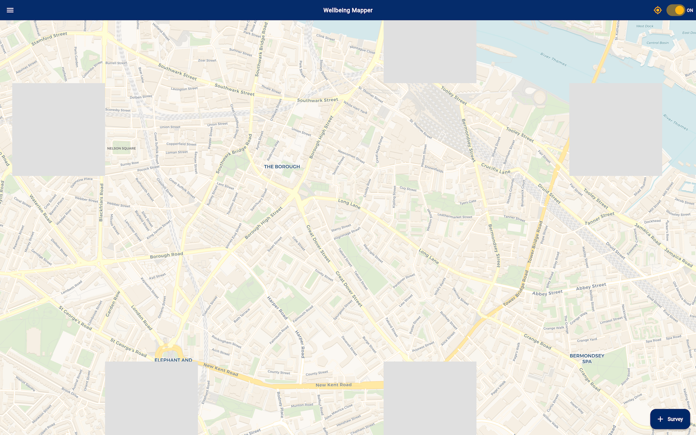

# Screenshots Gallery

This page showcases the user interface of Wellbeing Mapper across different devices and form factors.

## Mobile Interface (iPhone 16 Plus)

### Welcome and Mode Selection

  
  

*Left: Welcome screen with Planet4Health branding. Right: Mode selection for beta testing or private use.*

### Main Dashboard and Map

  
  

*Left: Main dashboard with survey options and wellbeing tracking. Right: Interactive location map with GPS tracking.*

### Survey Interface

  
  

*Left: Wellbeing survey introduction. Right: Interactive survey questions with slider controls.*

### Settings and Menu

  

*Settings menu with privacy controls and app configuration options.*

## Tablet Interface

### 7-inch Tablet (Landscape Mode)

#### Welcome and Navigation

  

*Welcome screen optimized for 7-inch tablet in landscape orientation.*

#### Map and Location Features

  

*Interactive map view with enhanced visibility on tablet screens.*

#### Menu and Settings

  

*Main menu with larger touch targets optimized for tablet use.*

#### Help and Guidance

  
  

*Top: User guide with instructions. Bottom: Help dialog with contextual assistance.*

### 10-inch Tablet (Landscape Mode)

#### Enhanced Map Experience

  

*Expanded map view taking advantage of larger screen real estate.*

#### Comprehensive Menu System

  

*Full menu interface with enhanced layout for larger tablets.*

#### Detailed Guidance

  

*Comprehensive user guide with improved readability on larger screens.*

#### Modal Dialogs

  
  

*Top: 10-inch tablet mode switching dialog. Bottom: 7-inch tablet version showing responsive design.*

## Design Features

### Responsive Design
- **Mobile-First**: Optimized for phones with touch-friendly interfaces
- **Tablet Enhanced**: Larger screens show more content and improved layouts
- **Landscape Support**: Full landscape mode support for tablets
- **Consistent Branding**: Planet4Health theme maintained across all screen sizes

### Accessibility Features
- **Large Touch Targets**: Easy interaction on all device sizes
- **Clear Typography**: Readable text across different screen densities
- **Intuitive Navigation**: Simple menu structure and clear visual hierarchy
- **Color Consistency**: Consistent color scheme for better user experience

### Cross-Platform Compatibility
- **iOS Support**: Native iOS interface with system-standard controls
- **Android Support**: Material Design elements where appropriate
- **Flutter Framework**: Single codebase ensuring consistent experience

## Beta Testing Focus Areas

When testing the app, please pay attention to:

1. **Interface Scaling**: How well does the UI adapt to your device size?
2. **Touch Responsiveness**: Are buttons and controls easy to interact with?
3. **Navigation Flow**: Is it easy to move between different sections?
4. **Content Readability**: Is text clear and appropriately sized?
5. **Visual Consistency**: Do colors, fonts, and layouts feel cohesive?

## Providing Screenshot Feedback

If you notice any visual issues or have suggestions for improvement:

1. **Take Screenshots**: Capture any problematic interfaces
2. **Note Device Details**: Include device model and screen size
3. **Describe Issues**: Explain what you expected vs. what you saw
4. **Suggest Improvements**: Share ideas for better user experience

Submit feedback through:
- **TestFlight**: Use the built-in feedback system
- **GitHub Issues**: Open detailed bug reports with screenshots
- **Email**: Send direct feedback to the development team

---

*Screenshots taken on iOS Simulator with iPhone 16 Plus and iPad Air configurations. Actual appearance may vary slightly on different devices.*
